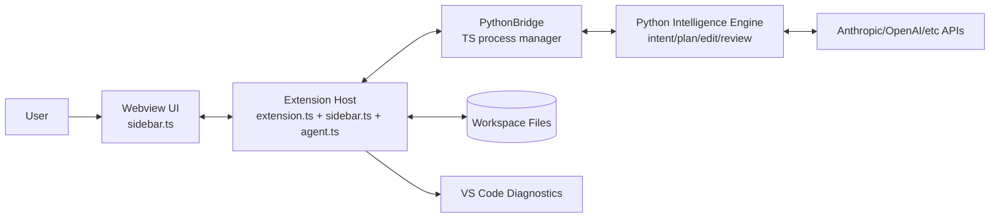
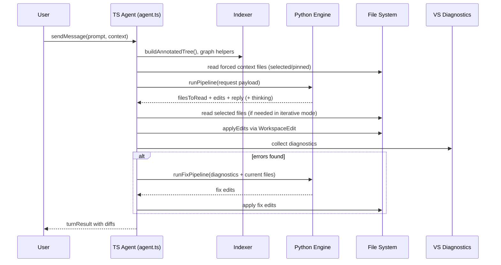

# AI CoWork New Architecture (TS Frontend + Python Intelligence)

This document defines the target architecture where:

- VS Code integration and UI remain in TypeScript.
- AI intelligence pipeline moves to Python.
- TS and Python communicate over a stable JSON protocol.

This is the recommended evolution from `OLD_ARCHITECTURE.md`.

---

## 1) Design Goals

- Keep VS Code APIs in TS where they belong.
- Decouple model logic from extension shell.
- Make intelligence easier to iterate/test in Python.
- Preserve existing UX (tabs, diffs, context, diagnostics auto-fix).
- Support gradual migration (stage-by-stage, not big-bang rewrite).

---

## 2) High-Level Target System



Key split:
- **TS owns**: UI, commands, indexer, file reads/writes, diagnostics, diff rendering.
- **Python owns**: `classifyIntent`, `classifyComplexity`, `selectFiles`, `plan`, `generateEdits`, `review`.

---

## 3) Component Boundaries

## A) TypeScript (kept in repo)
- `extension.ts`: activation + commands
- `sidebar.ts`: webview provider and message bridge
- `agent.ts`: orchestrator shell (context building, apply edits, diagnostics loop)
- `indexer.ts`: workspace graph/symbol metadata
- `diffUtils.ts`: diff UI data
- `types.ts`: shared TS contracts

## B) New Python package (to add)
- `python/engine.py` (or package `python/ai_engine/`)
- Modules (example):
  - `intent.py`
  - `complexity.py`
  - `file_selector.py`
  - `planner.py`
  - `coder.py`
  - `reviewer.py`
  - `schemas.py`
  - `providers/anthropic_client.py`

## C) New TS bridge (to add)
- `pythonBridge.ts`
- responsibilities:
  - spawn Python process
  - health check
  - request/response correlation by `id`
  - timeout and restart policy
  - stderr logging to output channel

---

## 4) Communication Protocol (TS <-> Python)

Use JSON Lines over stdin/stdout:
- one JSON request per line
- one JSON response per line
- strict `id` matching for concurrency safety

## Request shape

```json
{
  "id": "req_123",
  "method": "runPipeline",
  "params": {
    "prompt": "fix auth middleware",
    "history": [{"role":"user","content":"..."}],
    "fileTree": "Workspace: ...",
    "fileContents": [{"relPath":"src/a.ts","content":"..."}],
    "options": {"useParallel": true, "maxAttempts": 3}
  }
}
```

## Response shape

```json
{
  "id": "req_123",
  "ok": true,
  "result": {
    "reply": "Implemented auth fix",
    "thinking": "short rationale",
    "filesToRead": ["src/a.ts"],
    "edits": [
      {
        "relPath": "src/a.ts",
        "isNew": false,
        "summary": "Add null check",
        "oldString": "old snippet",
        "newString": "new snippet"
      }
    ],
    "skipped": []
  }
}
```

## Error response

```json
{
  "id": "req_123",
  "ok": false,
  "error": {
    "code": "PY_TIMEOUT",
    "message": "Pipeline timed out after 30s",
    "retryable": true
  }
}
```

---

## 5) New Turn Lifecycle



---

## 6) Migration Strategy (Recommended)

Do this in phases to keep extension stable.

## Phase 0: Bridge only
- Add `pythonBridge.ts`.
- Add `python/engine.py` with `ping`.
- Keep all intelligence in TS for now.

## Phase 1: Move classifiers
- Move `classifyIntent` and `classifyComplexity` to Python.
- TS fallback to current logic if Python fails.

## Phase 2: Move file selector + planner
- Move `selectFiles` and `createPlan`.
- Keep edit generation in TS.

## Phase 3: Move coder + reviewer
- Move `generateEdits`, `generateEditsParallel`, `reviewEdits`.
- Keep TS validators (`validateEdits`) for final guardrails.

## Phase 4: Optional
- Move full `pipeline.ts` logic to Python.
- Keep TS as orchestration shell + apply/diff/diagnostics.

At each phase:
- compile
- run smoke checks
- package `.vsix`

---

## 7) Failure Handling Rules

TS layer should enforce:

- Python process startup timeout.
- Per-request timeout.
- Auto-restart on process crash.
- Max restart backoff to avoid crash loops.
- User-friendly errors in sidebar.
- Safe fallback:
  - if Python unavailable, optionally run TS legacy pipeline (temporary compatibility mode).

---

## 8) Configuration Additions

Add extension settings:

- `aiCowork.pythonPath` (string, default `python3`)
- `aiCowork.pythonEntry` (string, default `python/engine.py`)
- `aiCowork.pythonTimeoutMs` (number, default 45000)
- `aiCowork.pythonEnable` (boolean, default `true`)
- `aiCowork.pythonFallbackToTs` (boolean, default `true` during migration)

---

## 9) Security and Trust Boundaries

- Keep file writes only in TS via VS Code APIs.
- Python should return edits, not write directly to workspace by default.
- Validate all Python-returned edits in TS before apply:
  - no path traversal
  - snippet existence checks
  - reject malformed edit objects

This preserves current safety posture.

---

## 10) Suggested New Repository Layout

```text
.
├─ extension.ts
├─ sidebar.ts
├─ agent.ts
├─ pythonBridge.ts            # NEW
├─ indexer.ts
├─ pipeline.ts                # temporary until fully migrated
├─ claudeClient.ts            # temporary until fully migrated
├─ types.ts
├─ python/                    # NEW
│  ├─ engine.py
│  ├─ schemas.py
│  ├─ providers/
│  │  └─ anthropic_client.py
│  └─ stages/
│     ├─ intent.py
│     ├─ complexity.py
│     ├─ selector.py
│     ├─ planner.py
│     ├─ coder.py
│     └─ reviewer.py
└─ docs/
   ├─ OLD_ARCHITECTURE.md
   └─ NEW_ARCHITECTURE_PYTHON_SPLIT.md
```

---

## 11) Compatibility Model

During migration, keep a dual-path orchestrator:

- if `pythonEnable=true` and bridge healthy -> Python path
- else if `pythonFallbackToTs=true` -> old TS path
- else -> hard error with setup instructions

This avoids blocking users while transitioning.

---

## 12) Testing Checklist for New Architecture

- Extension activates with and without Python available.
- `ping` succeeds and logs engine version.
- Simple question task returns reply.
- Simple code task returns valid edit and applies.
- Multi-file task still reads/apply/reviews correctly.
- Diagnostics loop still works post-apply.
- Drag/drop context still influences selected files.
- Tab histories remain isolated and persisted.

---

## 13) Final Notes

The split architecture keeps all VS Code-coupled behavior in TypeScript and moves AI-specific behavior into a language optimized for rapid ML iteration. This gives better maintainability without sacrificing existing UX and safety guarantees.

