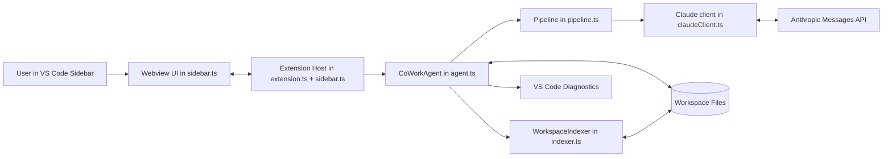
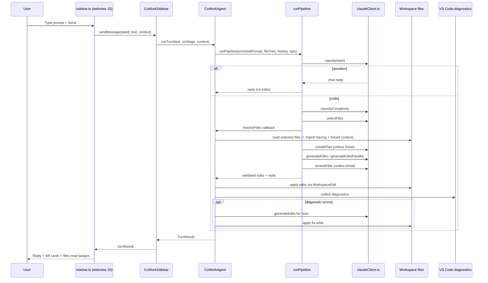

# AI CoWork Old Architecture (TS-Only Intelligence)

This document describes the original architecture of this repository where:

- Frontend/UI logic runs in TypeScript in the VS Code webview.
- Orchestration runs in TypeScript in the extension host.
- Intelligence (intent, planning, coding, review) also runs in TypeScript via Anthropic API calls.
- No Python runtime is required.

---

## 1) High-Level System

Core idea:
- `sidebar.ts` (webview + provider) handles UX and messaging.
- `agent.ts` handles turn execution and file edits.
- `pipeline.ts` decides process depth and calls AI stages.
- `claudeClient.ts` contains the AI prompts/tool schemas and API transport.
- `indexer.ts` provides searchable workspace structure/symbol/dependency metadata.

---

## 2) Runtime Layers

## A. Extension Activation Layer
- File: `extension.ts`
- Responsibilities:
  - Create output channel.
  - Construct `WorkspaceIndexer`.
  - Attempt cache restore (`indexer.tryLoad()`).
  - Register `CoWorkSidebar` webview provider.
  - Start `FileWatcher` for create/delete/change events.
  - Register commands:
    - `aiCowork.setApiKey`
    - `aiCowork.indexWorkspace`
    - `aiCowork.clearHistory`
    - `aiCowork.openChat`

## B. Sidebar/Webview Layer
- File: `sidebar.ts`
- Responsibilities:
  - Render HTML/CSS/JS chat UI.
  - Manage tabs (`Chat 1`, `Chat 2`, ...).
  - Track editor context (selected lines + active file).
  - Handle pinned files via drop/resolve flow.
  - Receive/send structured messages between webview and extension host.
  - Route per-tab user messages to `CoWorkAgent.runTurn(...)`.

## C. Agent Orchestration Layer
- File: `agent.ts`
- Responsibilities:
  - Build context preamble (selected lines + pinned files).
  - Run `runPipeline(...)`.
  - Resolve selected files into content.
  - Add deterministic import tracing and graph-based second-pass discovery.
  - Apply edits using `WorkspaceEdit`.
  - Run diagnostics feedback loop and optional AI auto-fix.
  - Persist conversation history.
  - Serialize result for diff rendering.

## D. Intelligence Layer (TS + API)
- Files: `pipeline.ts`, `claudeClient.ts`
- Responsibilities:
  - Intent classification: code vs question.
  - Complexity classification: trivial vs complex.
  - File selection.
  - Plan generation.
  - Edit generation (single or parallel candidates).
  - Validation and reviewer approval loop.
  - Conversational answer mode (no edits).

## E. Indexing/Graph Layer
- Files: `indexer.ts`, `symbolExtractor.ts`, `fileWatcher.ts`
- Responsibilities:
  - Scan workspace with ignore rules.
  - Build index of files + symbols + import graph.
  - Build transitive dependency closure.
  - Patch index on file changes.
  - Persist/reload index cache.

---

## 3) Data Flow (End-to-End Turn)

---

## 4) Indexing Architecture

## Build Phase
- Triggered manually (`Index Workspace`) or watcher re-index on create/delete.
- `WorkspaceIndexer.build()`:
  - loads `.gitignore` and `.fluxignore`.
  - recursively scans files (with extension whitelist + skip dirs/files + size limit).
  - extracts symbols and imports/exports.
  - builds maps:
    - `_imports` (file -> deps)
    - `_importedBy` (file -> dependents)
    - `_fileExports` (file -> exported symbols)
    - `_symbolToFiles` (symbol -> files)
  - computes transitive closure map `_transitiveDeps`.
  - caches result to storage (`index.json`).

## Incremental Updates
- `fileWatcher.ts`:
  - on create/delete: debounced full reindex.
  - on change: `indexer.patchFile(...)` + debounced cache save.
- `indexer.patchFile(...)` updates one file entry + graph links.

---

## 5) Pipeline Decision Model (Old)

`runPipeline(...)` in `pipeline.ts` controls the AI stages:

1. `classifyIntent`:
   - `question` -> direct `chatReply`, no edits.
   - `code` -> continue.
2. `classifyComplexity`:
   - `trivial`: shorter path, skip planner/reviewer.
   - `complex`: full pipeline.
3. `selectFiles` from annotated tree.
4. `resolveFiles` callback fetches file content.
5. optional second pass discovery for complex tasks.
6. `createPlan` (except trivial).
7. `generateEdits` (or parallel candidates).
8. `validateEdits` pre-apply checks.
9. `reviewEdits` for approval/retry (except trivial).

Safety checks include:
- path traversal block.
- mismatch of `isNew` vs existing file context.
- missing snippet anchors (`oldString` not found).

---

## 6) Edit Application Model

`CoWorkAgent.applyEdits(...)` uses two-pass logic:

- Pass 1:
  - Create new files immediately.
  - Apply snippet replacements in-memory for existing files.
- Pass 2:
  - Write full updated content for each modified existing file as single `WorkspaceEdit`.

Benefits:
- Better undo behavior.
- Avoid partial file corruption from multi-hunk write order.

---

## 7) Diagnostics Feedback Loop

After applying edits:

- wait briefly for language server updates.
- collect `Error` severity diagnostics for changed files.
- if errors exist and feature enabled:
  - ask AI to generate corrective edits from diagnostics.
  - validate and apply fix edits.

This makes the old architecture self-healing for common compile/lint breakages.

---

## 8) Webview Message Contract (Old)

Types are defined in `types.ts`.

- Webview -> Extension examples:
  - `ready`
  - `sendMessage`
  - `indexWorkspace`
  - `resolveDroppedFiles`
  - `openFile`
- Extension -> Webview examples:
  - `init`
  - `thinking`
  - `turnResult`
  - `indexStatus`
  - `resolvedFiles`
  - `error`

The webview never edits files directly; all file system operations happen in extension host code.

---

## 9) Persistence Model

- Conversation:
  - `HistoryStore` persists last ~40 messages per tab in `globalState`.
  - tab1 uses a legacy key for compatibility.
- Index:
  - `WorkspaceIndexer.saveCache()` stores index + graph maps in `context.storageUri/index.json`.
  - `tryLoad()` restores if workspace root matches.

---

## 10) Why This Is Called "Old Architecture"

This architecture is "old" because intelligence is tightly coupled to TypeScript modules (`pipeline.ts`, `claudeClient.ts`) and Anthropic request code inside the extension project itself.

In the proposed new direction:
- TS keeps UI + VS Code integration.
- intelligence moves to Python service/process.
- TS calls Python through a small protocol bridge.

That split reduces coupling and makes the model pipeline easier to iterate independently from the VS Code shell.

---

## 11) File Responsibility Map

- `extension.ts` -> activate extension, register commands/services.
- `sidebar.ts` -> webview provider + UI markup + message bridge.
- `agent.ts` -> turn orchestration + apply edits + diagnostics autofix.
- `pipeline.ts` -> high-level AI stage pipeline.
- `claudeClient.ts` -> prompts, tool schemas, HTTP API calls, validators.
- `indexer.ts` -> workspace scan, ignore logic, graph, cache.
- `symbolExtractor.ts` -> import/export/symbol extraction helpers.
- `fileWatcher.ts` -> filesystem events -> reindex/patch.
- `historyStore.ts` -> tab-scoped persisted chat history.
- `diffUtils.ts` -> in-memory line diff to HTML blocks.
- `types.ts` -> shared contracts between webview/extension/pipeline.

